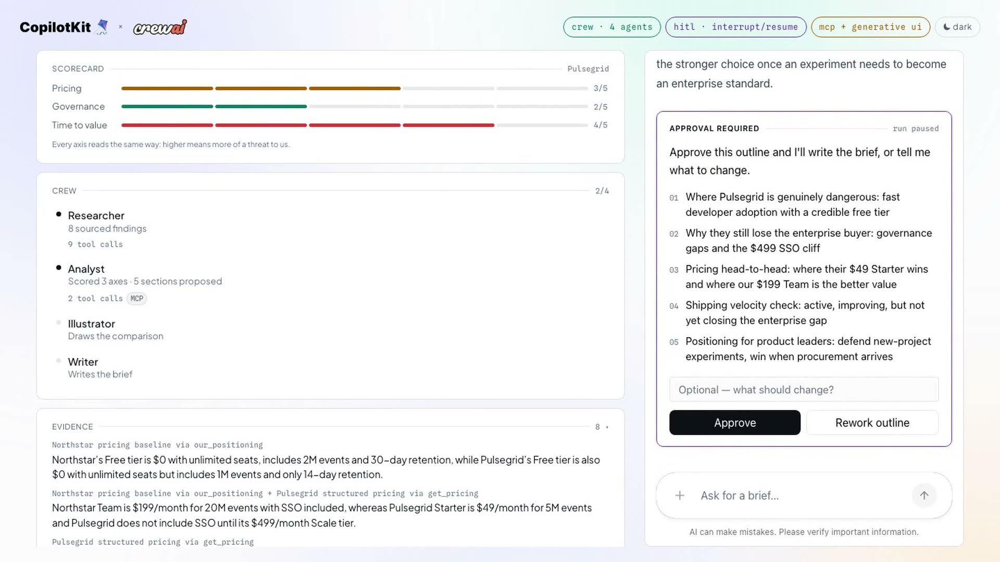

# CopilotKit × CrewAI

A competitive-intelligence brief workspace built on [`ag-ui-crewai` 0.3.0](https://pypi.org/project/ag-ui-crewai/).

Ask for a brief on a competitor. A four-agent CrewAI crew researches it, an
analyst scores it, **the run pauses for your approval**, then an illustrator
draws the comparison and a writer fills the brief in section by section — all
streaming over AG-UI into a CopilotKit UI.

The point of the demo is that none of those capabilities are bolted on to show
them off. Each one is there because the product needs it, and each happens to be
one of the things 0.3.0 added.

## The demo

A single unedited run — 75 seconds, no captions, nothing sped up. The long
stretch in the middle is the crew actually working.

[](https://github.com/jerelvelarde/agui-crewai-demo/releases/download/demo-footage/agui-crewai-demo-light.mp4)

*The frame above is the moment the run pauses — click it to play.* Also as
[`.webm`](https://github.com/jerelvelarde/agui-crewai-demo/releases/download/demo-footage/agui-crewai-demo-light.webm),
and in dark: [`.mp4`](https://github.com/jerelvelarde/agui-crewai-demo/releases/download/demo-footage/agui-crewai-demo.mp4) ·
[`.webm`](https://github.com/jerelvelarde/agui-crewai-demo/releases/download/demo-footage/agui-crewai-demo.webm).
All four are on the [`demo-footage`](https://github.com/jerelvelarde/agui-crewai-demo/releases/tag/demo-footage) release.

| | |
|---|---|
| `00:06` | Prompt submitted |
| `00:10` | Reasoning stream, before any tool runs |
| `00:11` | Researcher tasked — tool calls stream into the chat |
| `00:25` | Analyst scoring — MCP tool calls attributed on the crew panel |
| `00:27` | **Run pauses** — approval required |
| `00:35` | Approved — Illustrator draws, then the brief fills in |
| `01:03` | Brief written, 5/5 sections |

## Run it

```bash
make install
cp agent/.env.example agent/.env   # add your OPENAI_API_KEY
make dev                           # agent :8008, web :3000
```

Then ask: **“brief me on Pulsegrid's pricing vs ours”**.

## What it demonstrates

| Beat in the demo | Capability | Where |
|---|---|---|
| Model thinks before acting | reasoning stream | `flow.py::intake` |
| Competitor name appears before the call finishes | predictive state | `copilotkit_predict_state` |
| Researcher → Analyst → Illustrator → Writer, each attributed | crew-inside-flow attribution | `crew.py` |
| Corpus tools run server-side, results render | backend tool rendering | `tools.py` |
| Scorecard as a rich component | generative UI / A2UI | `flow.py::present` |
| Run genuinely pauses, then resumes | interrupt / resume | `flow.py::approve_outline` |
| Brief opens with a chart the agent chose | agent-directed, data-backed generative UI | `visuals.py` |
| Brief fills in section by section | shared-state streaming | `flow.py::_write_sections` |
| Analyst checks shipping velocity over MCP | MCP tool visibility | `mcp_server.py` |
| Attach a pricing screenshot to the ask | multimodal input | `make verify-multimodal` |
| Per-turn routed Q&A | Conversational Flows | `conversational.py` |

MCP is a real stdio server (`cadence/mcp_server.py`), spawned by CrewAI and
attached to the Analyst via `Agent(mcps=[...])`. It produces genuine
`mcp_connection_*` / `mcp_tool_execution_started` events and a real
`shipping_velocity` tool call — not a stand-in. Set `CADENCE_DISABLE_MCP=1` to
drop the subprocess.

Two endpoints, on purpose:

- `/brief` — the pipeline above, a regular Flow.
- `/concierge` — CrewAI **Conversational Flows**. Opting a flow into
  `conversational = True` installs CrewAI's own conversational graph in place of
  a hand-authored one, so it cannot host the brief pipeline. It gets its own
  endpoint where it is the actual subject rather than a flag on something else.

## The interface

Two states, and the second one only arrives when it has earned its place.

**Idle** is a hero: one headline, one line of copy, the composer, three things to
try. **Working** keeps the run in the conversation — reasoning, a card per agent
as it is tasked, the pipeline itself as an inline component, and the approval
pause rendered where the agent asked the question. The canvas stays closed until
the Analyst has actually scored something; a panel of skeletons during a 20-second
research phase reads as a layout that failed to load, not as anticipation.

Surface is `#010507`, CopilotKit's approved dark brand context. Each accent has
exactly one job, so a colour on screen means something: `--agent` lilac is the
agent's own voice, and the scorecard's red/orange/mint is threat level, never
decoration.

There is a light mode too — the toggle sits in the brand bar, and the choice
persists. It is a second set of tokens, not a filter: no component knows a theme
exists. Two things could not simply invert. The elevation washes were translucent
whites lifting a card off near-black, which does nothing on white, so light uses
plain white cards on a faintly tinted page and lets the border separate them. And
the accents had to be re-tuned rather than reused: on white, dark-mode mint sits
at 1.4:1 and lilac at 1.7:1, which is not a colour any more. Each keeps its hue
and its one job but is darkened to carry it — `--agent` becomes `#6430AB`, the
violet already in the CopilotKit kite, so the agent's voice stays a brand colour.
Every accent clears 4.5:1 against the page, because these set pill text and not
just the scorecard bars.

Both marks are the shipped assets rather than traced approximations — the
CopilotKit lockup with its wordmark reversed for a near-black surface, and the
crewAI mark as crewAI publishes it (they serve one file for both light and dark).

## Evidence, not assertions

```bash
make verify
```

Drives a full brief and asserts the AG-UI stream really carries each capability —
reasoning events, `TOOL_CALL_RESULT`, repeated `STATE_SNAPSHOT`, a resumable
interrupt on `RUN_FINISHED.outcome`, and a successful resume. Prints a checklist
and writes the raw stream to `docs/evidence/`.

```bash
make verify-multimodal   # same brief, prompt carries an attached image
make capabilities        # what this install says it supports
```

## Recording it

```bash
make record         # both servers must be up
make record-light   # the same run, filmed in light mode
```

Drives the real app in a headless browser and captures 1080p footage to
`docs/video/` as `.webm` plus an H.264 `.mp4` (faststart, so it plays inline on
X, LinkedIn and Slack). Deliberately **clean footage** — no burned-in captions
or titles, so it can be narrated or titled in post.

The two cuts write different basenames — `agui-crewai-demo` and
`agui-crewai-demo-light` — so neither overwrites the other. Light mode is set through
`localStorage` before the first page script runs, otherwise the recording would
open on a dark frame and then flip.

It prints a chapter list with timestamps, which is what you want for trimming:
the crew phase is the long stretch, and the beats either side of it are where the
interesting frames are.

What `verify-multimodal` does and does not prove: it proves the image part
travels the whole path — AG-UI `ImageInputContent` → the bridge's `image_url`
conversion → the provider — because the provider validates the bytes (a
malformed image fails the run outright) and the full brief still completes. It
does **not** prove the model read anything meaningful, since the generated test
image is a solid colour. For that, drop a real pricing screenshot into the chat.

## Offline by design

`agent/corpus/` holds committed competitor data — pricing pages, docs, reviews,
changelogs — and every tool reads only from there. No network research, so runs
are byte-identical and recordings are repeatable.

The hero chart holds that line under a fourth agent. The Illustrator chooses
which comparison to draw and writes the sentence framing it; every plotted
figure is built from the corpus by `visuals.py`. So the prose varies run to run
and the chart does not, and a figure can never contradict the real one printed
beside it. `OPENAI_API_KEY` is the only
secret.

Competitors are fictional: **Beacon Analytics** (enterprise-first),
**Pulsegrid** (bottom-up, free tier), **Telemetryx** (consolidation play), all
compared against our own **Northstar**.

## Verified environment

Probed, not assumed: `ag-ui-crewai==0.3.0`, `crewai==1.15.15`, Python 3.12,
CopilotKit `1.67.1`, Next.js 16 / React 19. The AG-UI dojo runs this same
CopilotKit set at `1.55.1` — the documented fallback if A2UI or interrupt wiring
misbehaves at latest.

## One upstream bug worth knowing

`get_capabilities()` reports:

```json
"humanInTheLoop": { "supported": true, "mechanism": "frontend-tool-calls", "interrupts": false }
```

That `interrupts: false` is a **hardcoded literal**. The same module computes
`_human_feedback_available = True`, and the package ships a working
`AGUIFeedbackProvider` driving CrewAI's `@human_feedback` pause/resume — which is
exactly what this demo runs on. Interrupts work; the capability blob
under-reports them, so anyone probing capabilities programmatically would
conclude CrewAI lacks the interrupt support 0.3.0 announces.

Details and reproduction in [`docs/spec.md`](docs/spec.md).

## Layout

```
agent/    Python 3.12 · uv · FastAPI · ag-ui-crewai · crewai
  cadence/
    flow.py            the brief pipeline
    conversational.py  Conversational Flows endpoint
    crew.py            Researcher → Analyst → Illustrator → Writer
    visuals.py         corpus → chart data (the agent never supplies a figure)
    tools.py           corpus-backed backend tools
    parsing.py         crew text → typed state (unit-tested)
    state.py           BriefState
    server.py          FastAPI + endpoint registration
  corpus/              committed competitor data
  scripts/             verify_stream.py
web/      Next.js 16 · CopilotKit 1.67.1 · Tailwind 4
  app/
    components/
      workspace.tsx    layout, interrupt, tool renderer
      panels.tsx       hero, brand bar, inline pipeline, scorecard, brief
      agent-tasks.tsx  attribution store → one card per agent tasked
```

## Licence

MIT. The CopilotKit and crewAI logos are their owners' trademarks and are
included for attribution in a joint demo, not licensed under the MIT grant.
